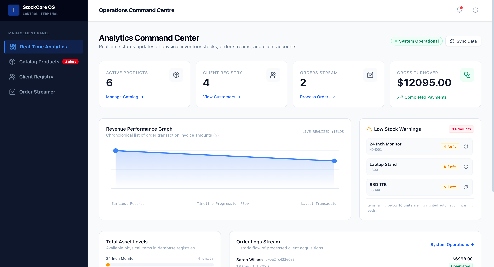
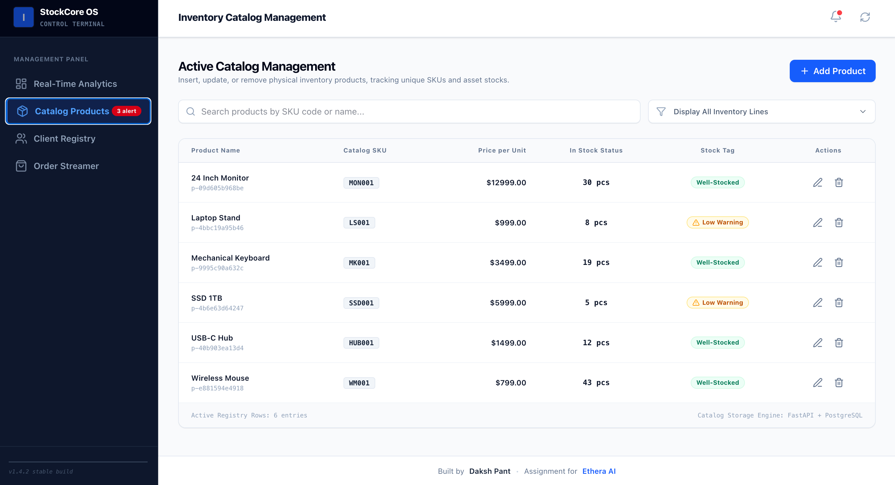
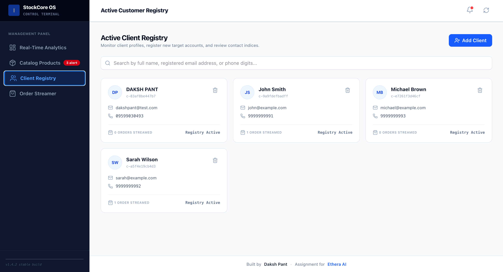
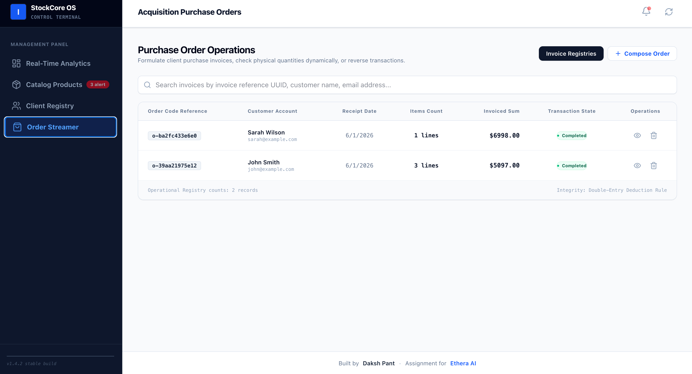

A production-ready Inventory & Order Management System built with React, FastAPI, PostgreSQL, Docker, and Docker Compose.

Features include product management, customer management, order processing, inventory tracking, automatic stock deduction, and public cloud deployment using Vercel and Railway.

# 🚀 Deployment & Deliverables

## 🌐 Live Application

| Service                        | URL                                                                           |
| ------------------------------ | ----------------------------------------------------------------------------- |
| Frontend (Vercel)              | https://inventory-order-management-system-gray.vercel.app/                    |
| Backend API (Railway)          | https://inventory-order-management-system-production-4882.up.railway.app/     |
| API Documentation (Swagger UI) | https://inventory-order-management-system-production-4882.up.railway.app/docs |

---

# 📸 Screenshots

## Dashboard

![Dashboard]

Displays key business metrics including:

- Total Products
- Total Customers
- Total Orders
- Revenue Generated
- Low Stock Products

---

## Product Management



Features:

- Add Products
- Update Products
- Delete Products
- Inventory Tracking
- SKU Validation

---

## Customer Management



Features:

- Create Customers
- View Customer List
- Delete Customers
- Unique Email Validation

---

## Order Management



Features:

- Create Orders
- View Order History
- Inventory Validation
- Automatic Stock Deduction
- Backend Calculated Totals

---

## 📦 Docker Hub Images

| Service  | Docker Hub Repository                                 |
| -------- | ----------------------------------------------------- |
| Backend  | https://hub.docker.com/r/dakshpant/inventory-backend  |
| Frontend | https://hub.docker.com/r/dakshpant/inventory-frontend |

---

## 💻 Source Code

GitHub Repository:

https://github.com/dakshpant/Inventory-Order-Management-System

---

# 🐳 Docker Support

The entire application is fully containerized using Docker and Docker Compose.

### Included Configuration

- Production-ready Backend Dockerfile
- Frontend Dockerfile
- Docker Compose Configuration
- Environment Variable Support
- PostgreSQL Persistent Storage
- Multi-Service Container Orchestration

### Run Locally

```bash
docker compose up --build
```

### Stop Services

```bash
docker compose down
```

### Services Started

- Frontend
- Backend API
- PostgreSQL Database

---

# ✅ Assessment Requirements Coverage

## Backend

- FastAPI
- SQLAlchemy ORM
- PostgreSQL Integration
- Pydantic Request Validation
- Structured Error Handling
- RESTful API Design

## Frontend

- React
- Axios API Integration
- Responsive User Interface
- Form Validation
- Dashboard Analytics

## Database

- PostgreSQL
- Persistent Data Storage
- Relational Data Modeling

## Containerization

- Docker
- Docker Compose
- Backend Docker Image
- Frontend Docker Image
- PostgreSQL Named Volume

## Deployment

- Frontend Deployed on Vercel
- Backend Deployed on Railway
- Public API Documentation
- Public Docker Hub Images

---

# 📋 Submission Deliverables

### GitHub Repository

https://github.com/dakshpant/Inventory-Order-Management-System

### Live Frontend

https://inventory-order-management-system-gray.vercel.app/

### Live Backend API

https://inventory-order-management-system-production-4882.up.railway.app/

### API Documentation

https://inventory-order-management-system-production-4882.up.railway.app/docs

### Docker Hub Images

Backend:

https://hub.docker.com/r/dakshpant/inventory-backend

Frontend:

https://hub.docker.com/r/dakshpant/inventory-frontend

---

# ⚙️ Business Rules Implemented

- Unique Product SKU Validation
- Unique Customer Email Validation
- Inventory Quantity Validation
- Inventory Sufficiency Checks Before Order Creation
- Automatic Inventory Deduction on Order Creation
- Automatic Inventory Restoration on Order Cancellation
- Backend Calculated Order Totals
- Request Validation Using Pydantic
- Proper HTTP Status Codes
- Structured Error Responses

---

# 🎯 Project Highlights

- Full-Stack Inventory & Order Management System
- React + FastAPI + PostgreSQL Architecture
- Fully Dockerized Application
- Docker Compose Multi-Service Setup
- Public Cloud Deployment (Vercel + Railway)
- Swagger API Documentation
- Production-Ready Environment Configuration
- Persistent PostgreSQL Storage
